# paper2table

[](https://paper2table.readthedocs.io/en/stable/)
[](https://pypi.org/project/paper2table/)

> Extract tables from papers

`paper2table` is a toolchain for extracting tabular information from scientific papers. It is composed of various command-line programs:

- `paper2table`: the main command, which is used to extract data
- `paper2pipeline`: a command for running a declarative pipeline of paper2table tools
- `filenorm`: a command for preparing papers
- `tablemerge`: a command for merging result of multiple `paper2table` runs
- `tablestats`: a command for querying `paper2table` and `tablemerge` resultsets
- `tablegather`: a command for combining multiple `paper2table` and `tablemerge` resultsets into one
- `table2html`: a command for generating simple extracted data visualizations
- `table2csv`: a command for exporting tables to csv files
- `tablevalidate`: a command for validating tables files


<!-- vscode-markdown-toc -->
* 1. [Usage](#Usage)
	* 1.1. [Installing](#Installing)
	* 1.2. [Preparing files](#Preparingfiles)
	* 1.3. [Running](#Running)
		* 1.3.1. [Hybrid mode](#Hybridmode)
		* 1.3.2. [Split-pages mode](#Split-pagesmode)
	* 1.4. [Merging](#Merging)
		* 1.4.1. [Column alignment](#Columnalignment)
		* 1.4.2. [Column aliases](#Columnaliases)
		* 1.4.3. [Column name hints](#Columnnamehints)
		* 1.4.4. [Schema](#Schema)
		* 1.4.5. [Compacting consecutive fragments](#Compactingconsecutivefragments)
	* 1.5. [Querying stats](#Queryingstats)
	* 1.6. [Visualizing data](#Visualizingdata)
	* 1.7. [ Gathering](#Gathering)
		* 1.7.1. [Key columns](#Keycolumns)
		* 1.7.2. [Meta-columns](#Metacolumnsintablegather)
		* 1.7.3. [Convergence filter](#Convergencefilter)
		* 1.7.4. [Metadata](#Metadata)
	* 1.8. [Running a pipeline](#Runningapipeline)
* 2. [Development](#Development)
	* 2.1. [Running tests](#Runningtests)
	* 2.2. [Type checking](#Typechecking)
* 3. [Architecture](#Architecture)
	* 3.1. [TablesFile format](#TablesFileformat)
	* 3.2. [Meta-columns convention](#Metacolumnsconvention)
	* 3.3. [Metadata files](#Metadatafiles)
	* 3.4. [Processing pipeline](#Processingpipeline)
	* 3.5. [Class diagram](#Classdiagram)

<!-- vscode-markdown-toc-config
	numbering=true
	autoSave=true
	/vscode-markdown-toc-config -->
<!-- /vscode-markdown-toc -->


##  1. <a name='Usage'></a>Usage

###  1.1. <a name='Installing'></a>Installing

```bash
# install base dependencies
pip install -e .

# install testing dependencies
pip install -e .[testing]

# install tox build tool
pip install tox
```

#### Docker

Build the image once from the repository root:

```bash
docker build -f docker/Dockerfile -t paper2table .
```

All commands below have Docker equivalents. Mount the directory containing your PDFs or result files to `/data` inside the container — the working directory is `/data`, so paths starting with `/data/` work naturally.

###  1.2. <a name='Preparingfiles'></a>Preparing files

Before running `paper2table`, it is recommended that you normalize your input papers files first, so that you avoid duplicate work. In order to do so, a small program `filenorm` is provided that will remove duplicate files and normalize filenames.

```bash
# normalize all the given files
# will ask for confirmation before each change
filenorm -q PATH [PATH ...]

# don't ask for confirmation. a log with each change will be printed
filenorm -y PATH [PATH ...]
```

```bash
# Docker equivalent
docker run --rm -v /path/to/pdfs:/data paper2table filenorm -y /data
```

###  1.3. <a name='Running'></a>Running

`paper2table` can read paper's table using three different backends:

- the [pdfplumber](https://github.com/jsvine/pdfplumber) package (this is the default option)
- the [camelot](https://camelot-py.readthedocs.io/en/master/) package
- an external generative agent. This option is usually more robust, but slower, less deterministic and presents additional costs

```bash
# basic usage
paper2table -p SCHEMA PATH [PATH ...]

# e.g. use the default pdfplumber reader backend
paper2table -q tests/data/demo_table.pdf

# e.g. use the pdfplumber reader specifying column name hints
paper2table -r pdfplumber -c tests/data/demo_column_hints.txt tests/data/demo_table.pdf

# e.g. use the camelot reader backend
paper2table -r camelot -q tests/data/demo_table.pdf

# by default paper2table outputs data to stdout
# but you can specify an output directory
paper2table -o . tests/data/demo_table.pdf
# result will be stored in demo_table.tables.json

# e.g. use the agent backend with the Gemini API
GEMINI_API_KEY=... paper2table -r agent -m google-gla:gemini-2.5-flash -p tests/data/demo_schema.txt tests/data/demo_table.pdf
```

```bash
# Docker equivalents
docker run --rm -v /path/to/pdfs:/data paper2table /data/paper.pdf

# write output back to the mounted directory
docker run --rm -v /path/to/pdfs:/data paper2table -o /data /data/paper.pdf

# agent backend (pass API key as env var)
docker run --rm -e GEMINI_API_KEY=... -v /path/to/pdfs:/data \
    paper2table -r agent -m google-gla:gemini-2.5-flash \
    -p /data/schema.txt /data/paper.pdf
```

####  1.3.1. <a name='Hybridmode'></a>Hybrid mode

Hybrid mode combines an LLM agent with a traditional reader backend. The agent analyses the PDF once to detect which tables are relevant and how their columns map to your schema. That mapping is then passed to the reader (`pdfplumber`, `camelot`, `pymupdf`) which performs the actual row extraction. This is usually more accurate and stable than running either approach alone.

Enable hybrid mode with `-H` together with a schema (`-p` or `-s`) and, optionally, `-r` to choose the underlying reader (default: `pdfplumber`).

```bash
# run hybrid mode with the default pdfplumber reader
GEMINI_API_KEY=... paper2table -H -m google-gla:gemini-2.5-flash \
    -p tests/data/demo_schema.txt \
    tests/data/demo_table.pdf

# use camelot as the underlying reader instead
GEMINI_API_KEY=... paper2table -H -r camelot -m google-gla:gemini-2.5-flash \
    -p tests/data/demo_schema.txt \
    tests/data/demo_table.pdf

# save mappings to a custom directory (default: ./mappings)
GEMINI_API_KEY=... paper2table -H -m google-gla:gemini-2.5-flash \
    -p tests/data/demo_schema.txt \
    -M tests/data/mappings \
    tests/data/demo_table.pdf
```

The generated mapping is cached in the mappings directory (`<paper_name>.mapping.json`). On subsequent runs for the same PDF the agent step is skipped automatically. Use `-F` to force regeneration of the mapping:

```bash
# regenerate the mapping even if one already exists
GEMINI_API_KEY=... paper2table -H -F -m google-gla:gemini-2.5-flash \
    -p tests/data/demo_schema.txt \
    tests/data/demo_table.pdf
```

####  1.3.2. <a name='Split-pagesmode'></a>Split-pages mode

When using the agent reader (`-r agent`), the `--split-pages` flag sends the PDF to the agent one page at a time instead of all at once. This is useful when a paper is long and the agent model has input token limitations.

```bash
GEMINI_API_KEY=... paper2table -r agent --split-pages \
    -m google-gla:gemini-2.5-flash \
    -p tests/data/demo_schema.txt \
    tests/data/demo_table.pdf
```

Each mapping file records which model produced it and when, under a `metadata` field:

```json
{
  "tables": [ "..." ],
  "citation": "...",
  "metadata": {
    "model": "google-gla:gemini-2.5-flash",
    "date": "2026-03-23T10:00:00+00:00"
  }
}
```

###  1.4. <a name='Merging'></a>Merging

`paper2table` also provides a table merging program called `tablemerge`. In order to be able to use it, you'll need to first generate some metadata. You can produce it using the same `paper2table` command:

```bash
# this command will create a new directory with the resultset, adding a metadata file
# suitable for use with tablemerge command
paper2table -t -o tests/data/tables tests/data/demo_table.pdf
```

To resume an interrupted run or add new papers to an existing resultset, use `--append` with the UUID of the resultset:

```bash
# append new papers to an existing resultset
# papers already present in the resultset are skipped automatically
paper2table -t -o tests/data/tables --append <uuid> new_papers/*.pdf
```

`--append` aborts if the reader or model of the current invocation does not match the one recorded in the existing resultset.

After doing this, you can merge tables like this:

```bash
tablemerge -o tests/data/merges tests/data/demo_resultsets/*
```

```bash
# Docker equivalents
docker run --rm -v /path/to/data:/data paper2table -t -o /data/tables /data/*.pdf
docker run --rm -v /path/to/data:/data paper2table tablemerge -o /data/merges /data/tables/*
```

####  1.4.1. <a name='Columnalignment'></a>Column alignment

When different `paper2table` runs produce numeric column names (`0`, `1`, `2`) instead of semantic ones, `tablemerge` can align them automatically.

`--jaccard-column-alignment` uses Jaccard similarity on column values to detect which numeric column corresponds to which semantic column:

```bash
tablemerge --jaccard-column-alignment tests/data/demo_resultsets/*
```

`--column-alignment-threshold` sets the minimum similarity score (default: 0.5):

```bash
tablemerge --jaccard-column-alignment --column-alignment-threshold 0.6 tests/data/demo_resultsets/*
```

`--column-value-semantic-alignment` adds a merge-time NLP pass (spaCy) that runs after Jaccard, comparing each numeric column's cell values against the semantic column names from the opposing fragment. No schema required:

```bash
python -m spacy download en_core_web_md
tablemerge --jaccard-column-alignment --column-value-semantic-alignment tests/data/demo_resultsets/*
```

`--column-name-semantic-alignment` adds a load-time NLP pass (spaCy) that compares each numeric column's cell values against the schema column names. Requires `-p`:

```bash
tablemerge -p tests/data/demo_schema.txt --column-name-semantic-alignment tests/data/demo_resultsets/*
```

Use `--semantic-language` to select the spaCy model language (`en` or `es`, default `en`):

```bash
python -m spacy download es_core_news_md
tablemerge --jaccard-column-alignment --column-value-semantic-alignment --semantic-language es tests/data/demo_resultsets/*
```

####  1.4.2. <a name='Columnaliases'></a>Column aliases

`--column-aliases` and `--column-aliases-path` let you define explicit renames applied during merging. The format is `alias:target` (same as the schema format):

```bash
tablemerge --column-aliases "familia:family especie:species" tests/data/demo_resultsets/*

tablemerge --column-aliases-path aliases.txt tests/data/demo_resultsets/*
```

Both flags can be used together; the file takes precedence on conflicts.

####  1.4.3. <a name='Columnnamehints'></a>Column name hints

`--column-names-hints` and `--column-names-hints-path` supply the expected column names for runs that produced only numeric column names (`0`, `1`, …). Hints use the same format as the `-c` flag in `paper2table` (whitespace- or comma-separated, `#` comments allowed):

```bash
tablemerge --column-names-hints "species family color" tests/data/demo_resultsets/*

tablemerge --column-names-hints-path hints.txt tests/data/demo_resultsets/*
```

Both flags can be combined; their hint lists are merged.

`--hints-column-alignment` activates hints-based column renaming: if at least one non-empty value in the first non-empty row of a table with numeric column names matches a hint, all numeric columns are renamed to their normalized first-row values (even columns whose value is not in the hints list). This pass runs before all other alignment steps:

```bash
tablemerge --column-names-hints "species family color" --hints-column-alignment tests/data/demo_resultsets/*
```

When `--remove-header-rows` is combined with hints, any row containing at least one non-semantic cell value that matches a hint is also removed, in addition to the usual semantic-column check:

```bash
tablemerge --column-names-hints "species family color" --remove-header-rows tests/data/demo_resultsets/*
```

####  1.4.4. <a name='Schema'></a>Schema

`-p` accepts either a file path or an inline schema string:

```bash
tablemerge -p "family:str species:str" --filter-schema-columns tests/data/demo_resultsets/*

tablemerge -p tests/data/demo_schema.txt --filter-schema-columns tests/data/demo_resultsets/*
```

A schema is a whitespace- or comma-separated list of `column:type` pairs. Supported types:

| Type              | Description                                         |
|-------------------|-----------------------------------------------------|
| `str`             | Plain string (no normalization)                     |
| `int`             | Integer                                             |
| `float`           | Floating-point number                               |
| `bool`            | Boolean                                             |
| `scientific_name` | Taxonomic name in binomial nomenclature (see below) |

##### `scientific_name` type

When a column is declared as `scientific_name`, `--coerce-schema-column-types` normalizes each cell value by parsing it through [gnparser](https://github.com/gnames/gnparser). The parser returns the **canonical form** of the name (genus + epithet, without authorship), which makes names comparable across papers that may include or omit authorship information.

Example: `"Ammi majus L."` and `"ammi majus l."` both normalize to `"Ammi majus"`.

**Dependency - gnparser**: required only when `scientific_name` columns are present in the schema and `--coerce-schema-column-types` is used. Installing `paper2table` does not require it; the dependency is only needed at runtime when coercion is triggered.

```bash
# install via Go
go install github.com/gnames/gnparser/gnparser@latest

# or download a pre-built binary from:
# https://github.com/gnames/gnparser/releases
# and place it on $PATH
```

####  1.4.5. <a name='Compactingconsecutivefragments'></a>Compacting consecutive fragments

When a table spans multiple pages, some readers split it into multiple separate tables. `--compact-consecutive-fragments` detects consecutive single-fragment tables and merges them into one before the cross-run merge:

```bash
# safe: only compact when both tables have semantic column names that match exactly
tablemerge --compact-consecutive-fragments safe tests/data/demo_resultsets/*

# unsafe: also compact when column count matches (for numeric column names)
tablemerge --compact-consecutive-fragments unsafe tests/data/demo_resultsets/*
```

###  1.5. <a name='Queryingstats'></a>Querying stats

A tool `tablestats` is provided for getting some stats about the extracted tables. It can be used to query both the direct output of a `paper2table` run or the results of a `tablemerge` output.

```bash
# generate a json file with stats
tablestats -o tests/data/stats.json tests/data/demo_resultsets/08ba0033-8b20-4dbb-bf4a-e2be1f194bc7/

# pretty print stats to stdout
# you can optionally sort results by number of extracted tables
tablestats --sort desc tests/data/merges

# if you only need to output empty files, use --empty
# this is useful for debugging your results
tablestats --empty tests/data/merges
```

```bash
# Docker equivalent
docker run --rm -v /path/to/data:/data paper2table tablestats /data/merges
```

###  1.6. <a name='Visualizingdata'></a>Visualizing data

A tool `table2html` is provided for displaying a resultset:

```bash
# it can be used both with the raw resultset of a paper2table run
# or with the output of tablemerge
table2html tests/data/merges
```

```bash
# Docker equivalent
docker run --rm -v /path/to/data:/data paper2table table2html /data/merges
```

###  1.7. <a name='Gathering'></a> Gathering

`tablegather` collects *all* `.tables.json` files from one or more result directories into
a single flat table. Unlike `tablemerge`, it does not pair files by name - it combines every
file regardless of filename. Every gathered row is annotated with `citation_`, `path_`,
`page_` and `fragment_` meta-columns so you can trace it back to its source paper, file,
page and fragment - see [Meta-columns](#Metacolumnsintablegather) below.

```bash
# gather all files in a resultset directory
$ tablegather tests/data/tables/

# write output to a directory (produces gathered.tables.json + tables.metadata.json)
$ tablegather --pretty -o tests/data/gathered/ tests/data/tables/

# gather from multiple directories at once
$ tablegather -o tests/data/gathered/ tests/data/tables/ tests/data/other_tables/
```

```bash
# Docker equivalent
docker run --rm -v /path/to/data:/data paper2table tablegather \
    -o /data/gathered /data/tables/
```

####  1.7.1. <a name='Keycolumns'></a>Key columns

Pass `-p` with a schema string to declare which columns are keys. Key columns are used to
sort (and thus visually group) rows across papers. Mark a column as a key by appending `:key`
to its type specifier:

```bash
# rows will be sorted by species name across all gathered papers
$ tablegather -p "species:str:key family:str" tests/data/tables/
```

Multiple key columns are supported; rows are sorted by the first key, then the second, and so on:

```bash
$ tablegather -p "family:str:key species:str:key" tests/data/tables/
```

The schema accepts a file path or an inline string, exactly like `tablemerge`.

####  1.7.2. <a name='Metacolumnsintablegather'></a>Meta-columns

Every row `tablegather` outputs is always annotated with four fixed meta-columns (their names
are not configurable - see [Meta-columns convention](#Metacolumnsconvention) for why):

| Column      | Type    | Meaning                                                                                          |
|-------------|---------|--------------------------------------------------------------------------------------------------|
| `citation_` | string  | The source paper's citation, taken directly from the `citation` field of the `.tables.json` file (absent if no citation is present) |
| `path_`     | string  | The path to the source `.tables.json` file                                                       |
| `page_`     | integer | The (1-indexed) page number of the table fragment the row came from                              |
| `fragment_` | integer | The (1-indexed) position of that fragment within its table                                       |
| `row_`      | integer | The (1-indexed) position of that row within its fragment, if present in the source data          |


```bash
$ tablegather tests/data/tables/
```
```javascript
{"citation_": "mamani_2020", "path_": "tests/data/tables/mamani_2020.tables.json", "page_": 3, "fragment_": 1, "row_": 1, "species": "Ammi majus"}
```

####  1.7.3. <a name='Convergencefilter'></a>Convergence filter

`--convergence` filters which rows are included based on how consistently they were extracted across runs. Accepted values:

- `none` (default) - include all rows
- `rows` - include only rows with a unique `row_` ID within their fragment (no duplicates)
- `fragments` - include only rows from fragments where every row is convergent
- `tables` - include only rows from tablesfiles where all tables are fully convergent

```bash
$ tablegather --convergence rows tests/data/tables/
```

####  1.7.4. <a name='Metadata'></a>Metadata

When `-o` is specified, `tablegather` writes a `tables.metadata.json` file alongside the
output, following the same format used by `paper2table` and `tablemerge`:

```javascript
    {
      "reader": "tablegather",
      "uuid": "...",
      "datetime": "...",
      "settings": {
        "key_columns": ["species"],
        "convergence": "none"
      },
      "sources": [
        {
          "path": "tests/data/tables/mamani_2020.tables.json",
          "uuid": "...",     // if present in the source file
          "reader": "..."    // if present in the source directory metadata
        }
      ]
    }
```


###  1.8. <a name='Runningapipeline'></a>Running a pipeline

`paper2pipeline` runs a sequence of paper2table tools from a single declarative JSON file, replacing ad-hoc shell scripts with a reproducible, single-command workflow.

```bash
paper2pipeline pipeline.json
```

The pipeline runs four optional steps in order — **normalize → extract → merge → gather** — and skips any section that is absent from the file.

#### Output directory layout

```
${output_path}/
  papers/          # only when normalize.inplace = true
  tables/
    ${uuid}/       # one per extract run
      *.tables.json
      stats.txt    # if extract.stats = true
      csv/         # if "csv" in extract.export
      viewer.html  # if "html" in extract.export
  merges/
    *.tables.json
    stats.txt      # if merge.stats = true
    csv/           # if "csv" in merge.export
    viewer.html    # if "html" in merge.export
  gathers/
    gathered.tables.json
    stats.txt      # if gather.stats = true
    csv/           # if "csv" in gather.export
    viewer.html    # if "html" in gather.export
```

#### Pipeline file format

```json
{
  "input_paths": ["tablas"],
  "output_path": "out",
  "schema_path": "schema.txt",

  "normalize": {
    "interactive": true,
    "inplace": false
  },

  "extract": {
    "runs": [
      {
        "reader": "agent",
        "model": "google-gla:gemini-2.5-flash",
        "model_sleep": 10,
        "verbose": false
      },
      {
        "reader": "pdfplumber"
      }
    ],
    "stats": true,
    "validate": true,
    "export": ["csv", "html"]
  },

  "merge": {
    "agreement_method": "distinct-readers",
    "jaccard_column_alignment": true,
    "semantic_language": "es",
    "validate": true,
    "stats": true,
    "export": ["csv", "html"]
  },

  "gather": {
    "convergence": "rows",
    "key_columns": ["species"],
    "stats": true,
    "export": ["csv", "html"]
  }
}
```

#### Top-level fields

| Field | Type | Description |
|-------|------|-------------|
| `input_paths` | `list[str]` | Directories (or files) containing the source PDFs |
| `output_path` | `str` | Root directory for all pipeline output |
| `schema_path` | `str` | Path to a schema file; passed to every tool that accepts `-p` |
| `normalize` | object | Optional. Run `filenorm` on the input PDFs |
| `extract` | object | Optional. Run one or more `paper2table` extraction passes |
| `merge` | object | Optional. Run `tablemerge` across all extract runs |
| `gather` | object | Optional. Run `tablegather` on the merge output |

#### `normalize` fields

| Field | Type | Default | Description |
|-------|------|---------|-------------|
| `interactive` | `bool` | `true` | `true` = prompt for each change; `false` = auto-confirm silently (`-y -q`) |
| `inplace` | `bool` | `false` | `true` = copy PDFs from `input_paths` into `${output_path}/papers/` first, then normalize there |

#### `extract.runs` fields (each run maps to one `paper2table` invocation)

| Field | Type | Default | Description |
|-------|------|---------|-------------|
| `reader` | `str` | `"pdfplumber"` | Extraction backend: `pdfplumber`, `camelot`, `agent`, `hybrid`, `pymupdf`, `img2table` |
| `model` | `str` | — | Language model (`-m`) |
| `model_sleep` | `int` | — | Seconds between model calls (`-z`) |
| `verbose` | `bool` | `false` | Enable verbose logging (`-vv`) |
| `hybrid` | `bool` | `false` | Enable hybrid mode (`-H`) |
| `force_mapping_generation` | `bool` | `false` | Regenerate mapping even if cached (`-F`) |
| `schema` | `str` | — | Inline schema string (overrides top-level `schema_path` for this run) |
| `column_names_hints_path` | `str` | — | Path to column name hints file (`-c`) |
| `split_pages` | `int` | — | Max pages per agent call (`--split-pages`) |
| `quiet` | `bool` | `false` | Suppress progress output (`-q`) |

The `stats`, `validate`, and `export` fields apply after **every** run:

| Field | Type | Default | Description |
|-------|------|---------|-------------|
| `stats` | `bool` | `false` | Run `tablestats` and write output to `${uuid}/stats.txt` |
| `validate` | `bool` | `false` | Run `tablevalidate` on the extracted tables |
| `export` | `list[str]` | `[]` | Export formats: `"csv"` → `table2csv`, `"html"` → `table2html` |

#### `merge` fields

All `tablemerge` settings are supported. Below are the most commonly used:

| Field | Type | Default | Description |
|-------|------|---------|-------------|
| `agreement_method` | `str` | `"simple-count"` | `"simple-count"` or `"distinct-readers"` |
| `filter_title_rows` | `bool` | `true` | Remove rows that duplicate column names |
| `jaccard_column_alignment` | `bool` | `false` | Align numeric columns by Jaccard value similarity |
| `column_alignment_threshold` | `float` | `0.5` | Minimum Jaccard similarity score |
| `column_name_semantic_alignment` | `bool` | `false` | Load-time NLP column alignment |
| `column_value_semantic_alignment` | `bool` | `false` | Merge-time NLP column alignment |
| `semantic_language` | `str` | `"en"` | spaCy language: `"en"` or `"es"` |
| `hints_column_alignment` | `str` | — | `"safe"` or `"unsafe"` |
| `fix_reversed_column_values` | `bool` | `false` | Detect and correct reversed cell values |
| `strip_leading_row_numbers` | `bool` | `false` | Strip leading sequential numbers from cells |
| `normalize_punctuation` | `bool` | `false` | Normalize punctuation in cell values |
| `split_conjunction_columns` | `bool` | `false` | Split conjunction columns |
| `transform_tablesfile` | `str` | — | `"explode"`, `"safe-compact"`, or `"unsafe-compact"` |
| `filter_schema_columns` | `bool` | `false` | Drop tables with no schema columns |
| `order_schema_columns` | `bool` | `false` | Reorder columns by schema order |
| `coerce_schema_column_types` | `bool` | `false` | Normalize cell types to schema types |
| `filter_semantic_columns` | `bool` | `false` | Remove numeric-named columns |
| `drop_empty_columns` | `bool` | `true` | Drop entirely empty columns |
| `drop_empty_tables` | `bool` | `true` | Drop entirely empty tables |
| `column_aliases` | `str` | — | Inline alias map (e.g. `"familia:family"`) |
| `column_aliases_path` | `str` | — | Path to alias map file |
| `column_names_hints` | `str` | — | Inline column name hints |
| `column_names_hints_path` | `str` | — | Path to hints file |
| `paper_aliases` | `str` | — | Inline paper alias map |
| `paper_aliases_path` | `str` | — | Path to paper alias map file |
| `stats` | `bool` | `false` | Run `tablestats` and write to `merges/stats.txt` |
| `validate` | `bool` | `false` | Run `tablevalidate` on the merged output |
| `export` | `list[str]` | `[]` | Export formats: `"csv"` and/or `"html"` |

#### `gather` fields

| Field | Type | Default | Description |
|-------|------|---------|-------------|
| `convergence` | `str` | `"none"` | `"none"`, `"rows"`, `"fragments"`, or `"tables"` |
| `key_columns` | `list[str]` | — | Column names to sort gathered rows by |
| `filter_schema_columns` | `bool` | `false` | Drop tables with no schema columns |
| `order_schema_columns` | `bool` | `false` | Reorder columns by schema order |
| `coerce_schema_column_types` | `bool` | `false` | Normalize cell types to schema types |
| `filter_semantic_columns` | `bool` | `false` | Remove numeric-named columns |
| `drop_empty_columns` | `bool` | `true` | Drop entirely empty columns |
| `drop_empty_tables` | `bool` | `true` | Drop entirely empty tables |
| `stats` | `bool` | `false` | Run `tablestats` and write to `gathers/stats.txt` |
| `export` | `list[str]` | `[]` | Export formats: `"csv"` and/or `"html"` |

##  2. <a name='Development'></a>Development

###  2.1. <a name='Runningtests'></a>Running tests

```bash
tox
```

###  2.2. <a name='Typechecking'></a>Type checking

```bash
tox -e lint
```


##  3. <a name='Architecture'></a>Architecture

###  3.1. <a name='TablesFileformat'></a>TablesFile format

`paper2table` and `tablemerge` output the extracted tables data in a `TablesFile` file format (with extension `.tables.json`). You can validate that those files follow the exact format using `tablevalidate`:

```bash
tablevalidate tests/data/demo_resultsets/*/*
```

```bash
# Docker equivalent
docker run --rm -v /path/to/data:/data paper2table tablevalidate /data/*.tables.json
```

The format is informally specified this way:

```json
{
  "tables": [
    {
      "rows": [
        {
          "COLUMN_NAME_1": "string | [{\"value\": \"string\", \"agreement_level\": integer}]",
          "COLUMN_NAME_2": "string | [{\"value\": \"string\", \"agreement_level\": integer}]",
          "agreement_level_": "integer (optional)",
          "sources_": "list of strings (optional)",
          "row_": "integer (optional)",
          "citation_": "string (optional, added by tablegather)",
          "path_": "string (optional, added by tablegather)",
          "page_": "integer (optional, added by tablegather)",
          "fragment_": "integer (optional, added by tablegather)"
        }
      ],
      "page": "integer"
    },
    {
      "table_fragments": [
        {
          "rows": "...",
          "page": "integer"
        }
      ]
    }
  ],
  "citation": "string | [{\"value\": \"string\", \"agreement_level\": integer}]",
  "metadata": {
    "filename": "string (optional)"
  }
}
```

Any field on a row ending in `_` is a meta-column rather than extracted data - see
[Meta-columns convention](#Metacolumnsconvention) below.

You can also find a proper JSON schema definition in [tablesfile.schema.json](./tablesfile.schema.json).

###  3.2. <a name='Metacolumnsconvention'></a>Meta-columns convention

Any `Row` field whose name ends in a trailing underscore (`_`) is a **meta-column**: bookkeeping
data added by a tool, as opposed to a semantic column holding data extracted from a table. This
is enforced by [tablesfile.schema.json](./tablesfile.schema.json): the `row` definition's
`patternProperties` only accepts non-underscore-suffixed names as free-form extracted data
(`^.*[^_]$`), and `additionalProperties: false` means any other trailing-underscore name must be
explicitly declared there. In code, this list is `tablevalidate.schema._META_COLUMNS`, and
`Row.get_columns()`/`Row.get_semantic_columns()` exclude meta-columns from "columns" - so any
column-oriented view (CSV/HTML export, semantic-column filtering, header-row detection, etc.)
naturally skips them unless a tool explicitly asks for a meta-column by name.

Meta-columns are produced by a specific tool to be meaningful for *that* tool's purpose, not
necessarily for every tool downstream. It is expected and fine for a tool to ignore
meta-columns it doesn't recognize or doesn't need - for example, `tablemerge` deliberately does
not propagate `tablegather`'s `citation_`/`path_`/`page_`/`fragment_` columns, because
`tablemerge` runs upstream of `tablegather` in the normal pipeline and has no use for them. If a meta-column ever does need to survive a
transformation, use `row.clone()` — it preserves all meta-columns by default, unlike a bare
`Row(...)` constructor which only carries the fields you explicitly pass.

Current meta-columns, by the tool that produces them:

| Meta-column        | Type    | Indexing             | Produced by                | Meaning                                                                                                                                                                         |
|--------------------|---------|----------------------|----------------------------|---------------------------------------------------------------------------------------------------------------------------------------------------------------------------------|
| `row_`             | integer | 0-indexed            | `tablemerge` (row merging) | Dedup-group id used to detect/collapse duplicate rows across merged fragments; unrelated to physical position, hence the different indexing base from `page_`/`fragment_` below |
| `sources_`         | list    | n/a                  | `tablemerge` (row merging) | UUIDs of the source runs that contributed to a merged row                                                                                                                       |
| `agreement_level_` | integer | n/a                  | `tablemerge` (row merging) | How many sources agreed on a row's/column's value                                                                                                                               |
| `citation_`        | string  | n/a                  | `tablegather`              | The source paper's citation; absent if the source file has no citation                                                                                                          |
| `path_`            | string  | n/a                  | `tablegather`              | Path to the source `.tables.json` file                                                                                                                                          |
| `page_`            | integer | 1-indexed            | `tablegather`              | Page number of the source table fragment                                                                                                                                        |
| `fragment_`        | integer | 1-indexed, per-table | `tablegather`              | Position of the source fragment within its table                                                                                                                                |

And consumed/displayed by:

| Tool            | Reads                                                                    |
|-----------------|--------------------------------------------------------------------------|
| `table2html`    | `row_`, `agreement_level_` (for row-span grouping and agreement styling) |
| `tablestats`    | `row_`, `agreement_level_` (for convergence/agreement stats)             |
| `tablevalidate` | `row_` (for convergence grouping)                                        |

`tablegather`'s meta-columns are the final, terminal layer of the pipeline (a gathered
`.tables.json` isn't meant to be fed back into `tablemerge`), so no other tool currently reads
`citation_`/`path_`/`page_`/`fragment_`.

###  3.3. <a name='Metadatafiles'></a>Metadata files

Both `paper2table` (with the `-t` flag) and `tablemerge` write a metadata file alongside the extracted tables. The file has the same structure in both cases:

```json
{
  "reader": "pdfplumber | camelot | agent | hybrid-pdfplumber-gemini-2.5-flash | tablemerge",
  "uuid": "UUID identifying this run",
  "datetime": "ISO 8601 timestamp of the run",
  "sources": [
    {
      "path": "path to the source resultset directory",
      "uuid": "UUID of the source extraction run (if available)",
      "reader": "reader used for the source run (if available)"
    }
  ]
}
```

###  3.4. <a name='Processingpipeline'></a>Processing pipeline

`tablemerge` processes each input file through three phases before writing the merged output.

**Phase 1 - Load time** (`TablesFileLoader`, once per input file):

| Step | Operation                                            | Classes                                                                              | Condition                         |
|------|------------------------------------------------------|--------------------------------------------------------------------------------------|-----------------------------------|
| 1    | `pretransformers` per fragment                       | `FragmentValuesReverser`, `FilterTitleRowsTransformer`, `FilterEmptyRowsTransformer` | per flag                          |
| 2    | `tablesfile_transformer.transformer`                 | `SafeConsecutiveFragmentsCompactor`, `UnsafeConsecutiveFragmentsCompactor`           | `--compact-consecutive-fragments` |
| 3    | `analyzers` per fragment via `LoadTimeColumnAligner` | `HintsAnalyzer`, `AliasAnalyzer`, `ColumnNameSemanticAnalyzer`                       | per flag                          |
| 4    | `posttransformers` per fragment                      | `FilterHeaderRowsTransformer`                                                        | `--remove-header-rows`            |

**Phase 2 - Merge time** (`TablesFileMerger`, once per fragment pair):

| Step | Operation                                     | Classes                                          | Condition |
|------|-----------------------------------------------|--------------------------------------------------|-----------|
| 1    | column alignment via `MergeTimeColumnAligner` | `JaccardAnalyzer`, `ColumnValueSemanticAnalyzer` | per flag  |
| 2    | row merging                                   | `TableFragmentBuilder`                           | always    |

**Phase 3 - Post-merge** (applied once to the merged output):

| Step | Operation       | Classes                                                                                                                                 | Condition |
|------|-----------------|-----------------------------------------------------------------------------------------------------------------------------------------|-----------|
| 1    | post-processors | `FilterSemanticColumnsPostProcessor`, `DropEmptyNonSemanticColumnsPostProcessor`, `DropEmptyTablesPostProcessor`, `SchemaPostProcessor` | per flag  |

```mermaid
classDiagram
    class LoadTimeAnalyzer {
        <<protocol>>
        +settings dict
        +build_mapping(column_names, rows) dict
    }
    class MergeTimeAnalyzer {
        <<protocol>>
        +settings dict
        +build_mapping(left_cols, right_cols, left_rows, right_rows) dict
    }
    class FragmentTransformer {
        <<protocol>>
        +settings dict
        +transform_fragment(fragment) TableFragment
    }
    class TablesfileTransformer {
        <<protocol>>
        +settings dict
        +transform(tablesfile) TablesFile
    }
    class PostProcessor {
        <<protocol>>
        +settings dict
        +postprocess(tablesfile) TablesFile
    }

    class TablesFileLoader {
        -pretransformers list~FragmentTransformer~
        -tablesfile_transformer TablesfileTransformer
        -analyzers list~LoadTimeAnalyzer~
        -posttransformers list~FragmentTransformer~
        +load(path) TablesFile
        +settings dict
    }
    class TablesFileMerger {
        -analyzers list~MergeTimeAnalyzer~
        +merge(tablesfiles) TablesFile
    }
    class LoadTimeColumnAligner {
        -analyzers list~LoadTimeAnalyzer~
        +build_mapping(fragment) dict
        +rename_row(row) Row
    }
    class MergeTimeColumnAligner {
        -analyzers list~MergeTimeAnalyzer~
        +build_mapping(left, right) dict
        +rename_row(row) Row
    }

    LoadTimeAnalyzer <|.. HintsAnalyzer
    LoadTimeAnalyzer <|.. AliasAnalyzer
    LoadTimeAnalyzer <|.. ColumnNameSemanticAnalyzer
    MergeTimeAnalyzer <|.. JaccardAnalyzer
    MergeTimeAnalyzer <|.. ColumnValueSemanticAnalyzer
    FragmentTransformer <|.. FragmentValuesReverser
    FragmentTransformer <|.. FilterTitleRowsTransformer
    FragmentTransformer <|.. FilterEmptyRowsTransformer
    FragmentTransformer <|.. FilterHeaderRowsTransformer
    TablesfileTransformer <|.. SafeConsecutiveFragmentsCompactor
    TablesfileTransformer <|.. UnsafeConsecutiveFragmentsCompactor
    PostProcessor <|.. FilterSemanticColumnsPostProcessor
    PostProcessor <|.. DropEmptyNonSemanticColumnsPostProcessor
    PostProcessor <|.. DropEmptyTablesPostProcessor
    PostProcessor <|.. SchemaPostProcessor

    TablesFileLoader o-- FragmentTransformer
    TablesFileLoader o-- TablesfileTransformer
    TablesFileLoader o-- LoadTimeAnalyzer
    TablesFileLoader --> LoadTimeColumnAligner
    TablesFileMerger o-- MergeTimeAnalyzer
    TablesFileMerger --> MergeTimeColumnAligner
```

###  3.5. <a name='Classdiagram'></a>Class diagram


